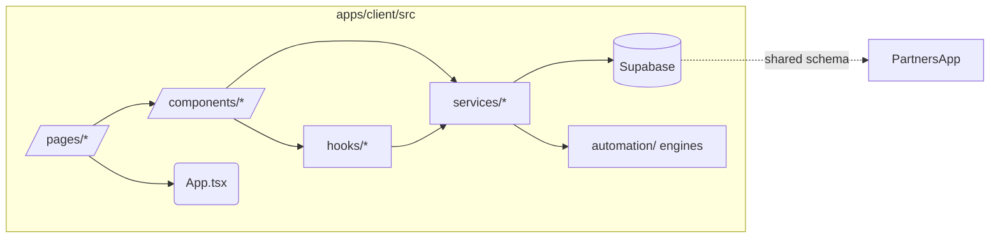
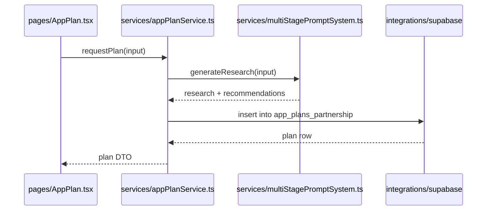

# Client App Diagrams

## Module Overview

```mermaid
flowchart LR
    subgraph ViteReact[apps/client/src]
        Pages[/pages/*/] --> Components[/components/*/]
        Components --> Services[services/*]
        Services --> Supabase[(Supabase)]
        Services --> Automations[automation/ engines]
        Components --> Hooks[hooks/*]
        Hooks --> Services
        Pages --> Router(App.tsx)
    end

    Supabase -. shared schema .-> PartnersApp
```

## Service Composition Example (App Plan generation)

```mermaid
sequenceDiagram
    participant Page as pages/AppPlan.tsx
    participant Service as services/appPlanService.ts
    participant MultiStage as services/multiStagePromptSystem.ts
    participant Supabase as integrations/supabase

    Page->>Service: requestPlan(input)
    Service->>MultiStage: generateResearch(input)
    MultiStage-->>Service: research + recommendations
    Service->>Supabase: insert into app_plans_partnership
    Supabase-->>Service: plan row
    Service-->>Page: plan DTO
```

_Add more diagrams (routing, admin data flow, etc.) as the client app evolves._
