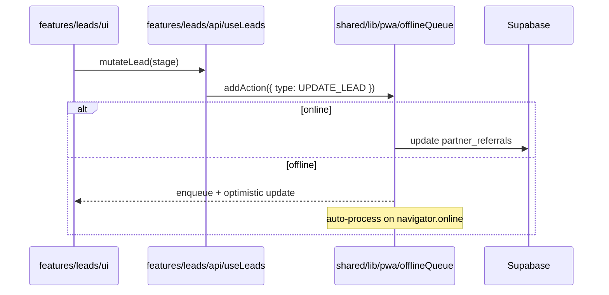

# Partners Architecture Diagrams

## Feature Slice Layout

```mermaid
graph TB
    subgraph app/partners/src
        Providers[(app/providers/*)] --> Router[app/router]
        Router --> Features[/features/*/]
        Features --> Entities[/entities/*/]
        Entities --> Shared[@shared/*]
        Shared --> Supabase[(Supabase)]
        Shared --> Platform[@shared/lib/pwa]
    end
```

## Data + Offline Flow (Leads example)



## Realtime & Presence

```mermaid
graph LR
    subgraph RealtimeProvider
        subgraph Hooks
            useRealtime --> subscribe
            useRealtime --> unsubscribe
        end
    end

    subscribe --> SupabaseChannel[(supabase.channel('chat:room'))]
    SupabaseChannel --> FeaturesChat[features/chat]
    SupabaseChannel --> EntitiesMessage
```

_Update or append diagrams whenever new flows (commissions, training, notifications) are implemented._
